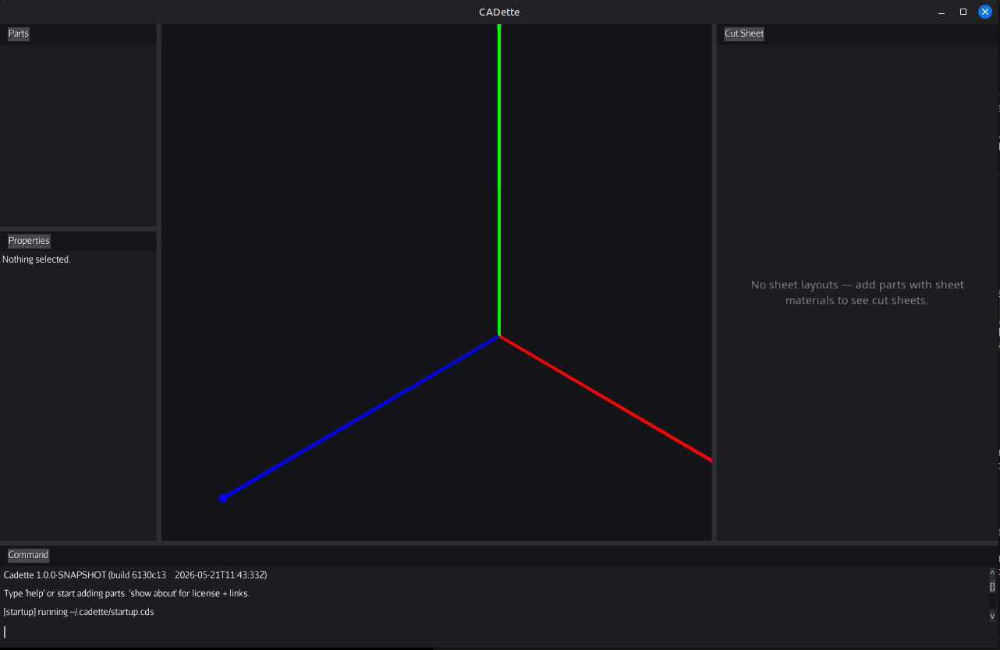
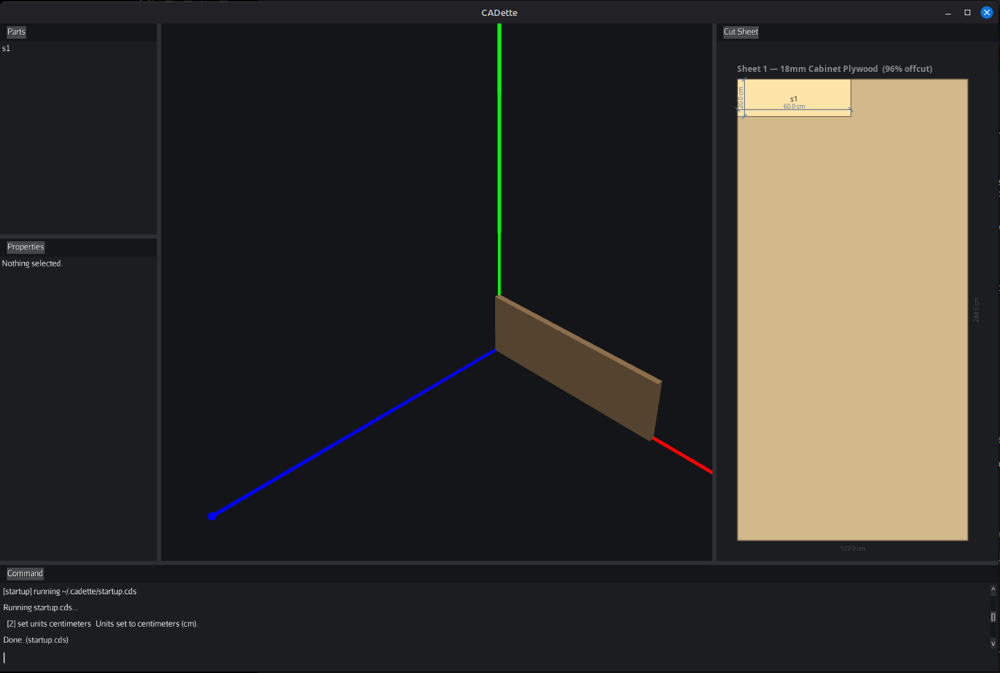
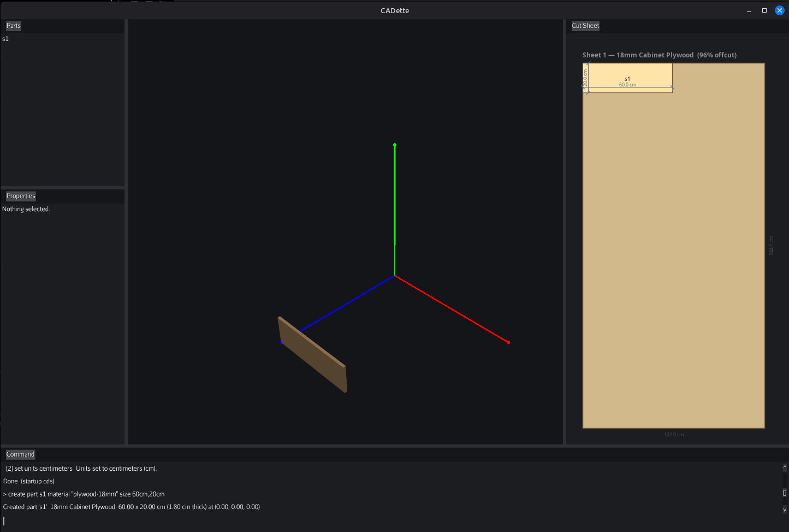
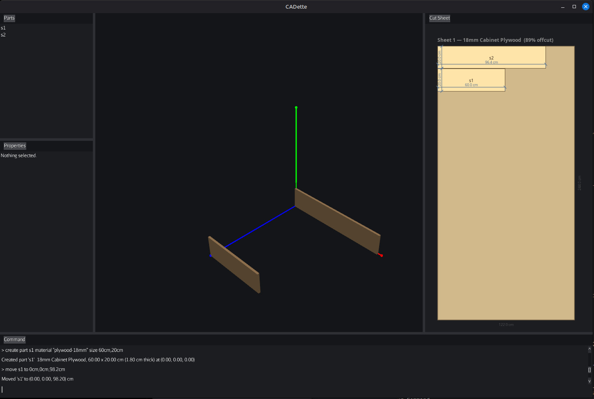
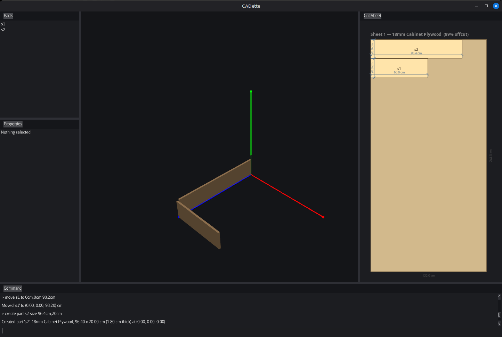
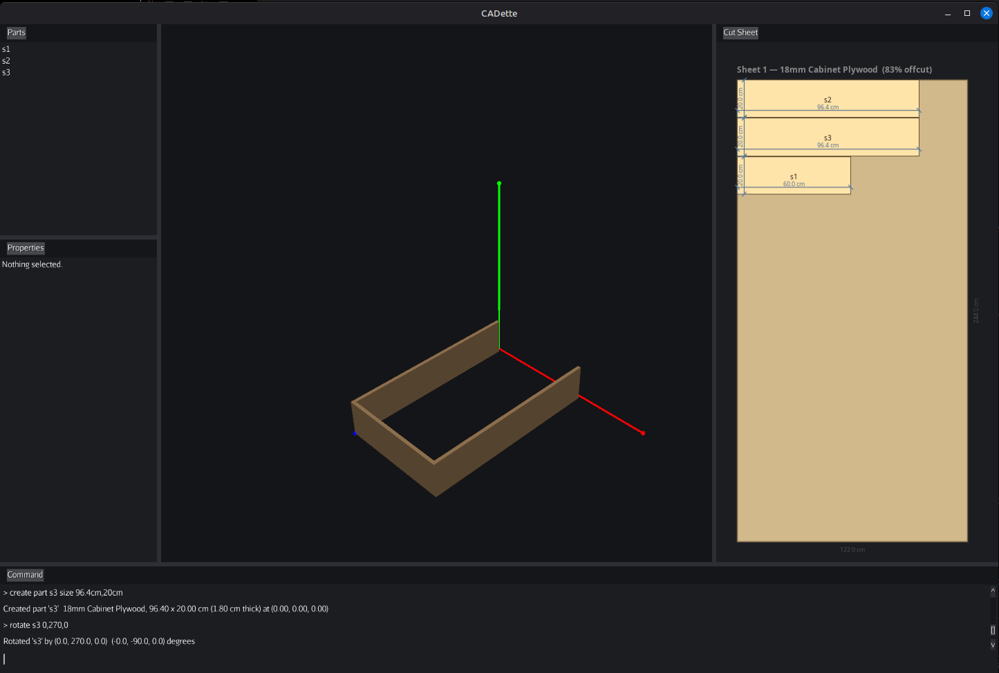
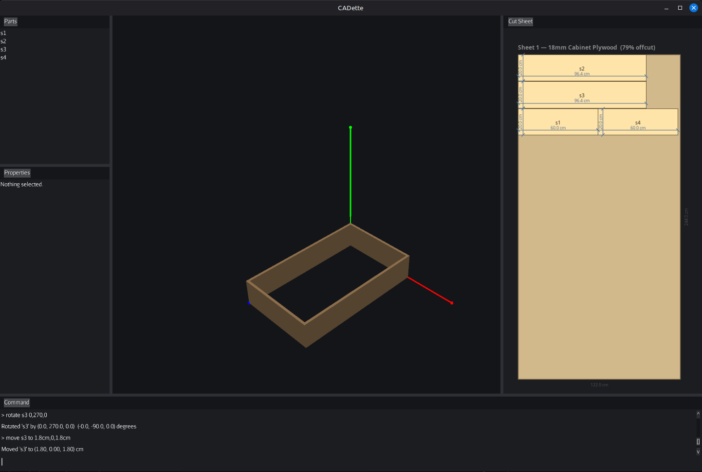
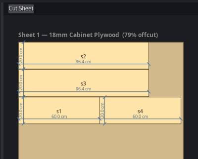

# CADette Tutorial

This tutorial will walk you through creating a simple box from scratch using the CADette 
system. The tutorial assumes you have CADette up and running - see the INSTALLATION.md file
for instructions on how to install CADette on your machine.

This tutorial will create a box that is 100cm x 60cm x 20cm out of 18mm plywood with the corners connected with pocket screws.

NOTE: The images on this tutorial are from an older version of CADette, but the result is the same.

## Create the parts of the box

The first thing we have to do is create the parts of the box. We'll walk through creation of each
part using the CADette scripting language.

### Part 1

The first thing we will do is create a part that is 60cm long and 20cm high. We'll start with the
scene empty. 





We're going to use the ```create part``` command to create a new part. The ```create part```
command enters the part into the scene. You can define several aspects of the part when you
create it - the size and location, but also the orientation, material, and rotation. Some of these
attributes - the location and rotation for example - can be changed after the part is created. Others, 
such as the material, are inherent to the part.

The material changes how the part looks in the scene but more importantly tells the cut sheet layout
engine how to position the part on material. That will be covered later in the tutorial.

To create the first part, enter the following command. Note that we can specify ```dimensional constant```
values - that is, we explicitly state that the size of the part is given in cm.

```
create part s1 material "plywood-18mm" size 60cm,20cm
```

The scene should look like this now.


As you can see, the part has been added to the scene, and CADette has automatically
started to lay out a cut sheet based on the material.

After creating the part, we are going to position the part
at the end of the box. We do this by moving the part, specifying the x, y, and z
locations.

```
move s1 to 0cm,0cm,98.2cm
```

You might be wondering why 98.2cm if we are creating a 100cm box. The reason
is how CADette references a part. The reference point for a part is determined when the part is created, and is on the _back_ face of the part. So if we want the _front_ face of the part to be at 100cm, we need to account for the thickness of the material. 98.2cm will position it to be ready to attach to the side when it is created. (98.2cm + 18mm = 100cm)

If this seems like a lot to keep track of, don't worry. First, CADette supports full undo/redo capabilities, so if you make a mistake you can undo it and try again. More importantly, these kinds of _assemblies_ (collections of parts) are usually created through templates, which do all the math for you.

The scene now looks like this (note that the zoom changed on the 3D view): 



### Part 2

Now we create a 100cm side piece that will eventually
attach to this part. Creating this part will take two
operations - first to create the part, and the second to 
rotate the part into the proper orientation in the scene.

Note, though, that we should not create exactly a 100cm part
We need to create a part that will butt up against the part that we just created. In order to do that, we have to account for the size of the material. 

On the roadmap, we'll be able to do this with references to an existing
part. Right now, we just have to do the math and remember to account for
both sides. So the part we want to create is 100cm - 18mm - 18mm, or a
total size of 96.4cm. Let's create that:

```
create part s2 material "plywood-18mm" size 96.4cm,20cm
```

And the scene now is:


In order for that piece to be oriented properly, we have
to rotate it. In this case, the rotation will be around the 
y axis and will be in the counter-clockwise direction. So we will need to swing the piece three-quarters of the
way around the circle. Rotations are currently specified in degrees,
so the rotation needs to be 270 degrees to get part in the right
orientation. (You could also specify -90 degrees to swing in the reverse
direction one quarter turn.)

```
rotate s2 0,270,0
```
Now we need to move the piece into place. There are two movements
we have to account for. In the x axis we need to move 60cm so that this 
new piece aligns with the edge of the first one. We also need to move it
1.8cm along the z axis so that it touches the first piece. The y axis does
not need to change

```
move s2 to 60cm,0,1.8cm
```

resulting in




If this all feels strange and new - it is! Don't worry. It will become more intuitive, and
as noted above most of the time you will be using templates and features of the language we are not
covering in this tutorial to relieve you from doing this math.


### Part 3

Similarly to S2, S3 the opposite side. Creating it is the same, so let's just create, rotate, and move all at once.

```
create part s3 material "plywood-18mm" size 96.4cm,20cm
rotate s3 0,270,0
move s3 to 1.8cm,0,1.8cm
```

resulting in:



### Part 4

And finally, the last part

```
create part s4 material "plywood-18mm" size 60cm,20cm
```




## Cut sheet

With the parts created, we can look at the cut sheet that we have to create. CADette will automatically lay out the pieces in a space-efficient manner on the cut sheet. You can see this any time by looking at the cut sheet view.




Note that because we didn't ask CADette to orient the pieces in any particular manner, the layout does not respect the grain. In most cases, you want to specify the orientation so that (for example) side panels have vertical grain, but that's beyond the scope of this tutorial.

## Joining the pieces

Right now, the pieces are just abutting each other but aren't attached.
Attaching in CADette is through creating a joint. Natively, CADette supports common joint times such as dados, rabbets, and pocket screws. CADette also supports the community creating and contributing new joint types to the system.

For now, we will use pocket screws for this box

```
join s2 to s1 with pocket_screw 2
join s3 to s1 with pocket_screw 2
join s2 to s4 with pocket_screw 2
join s3 to s4 with pocket_screw 2
```

In tutorial 2, we will use a similar approach but use rabbets to connect
the pieces, and demonstrate how to visually inspect those joints.

## Tutorial Script

One of the nice features of CADette is the ability to create, store, and share scripts that are repeated commands. CADette ships with a set of 
scripts, including the tutorials. So if we wanted to be lazy and do a lot less typing, we could have just created this box by executing the
tutorial 1 script:

```
run tutorials/tutorial_1_simple_box
```

The result is the same.
